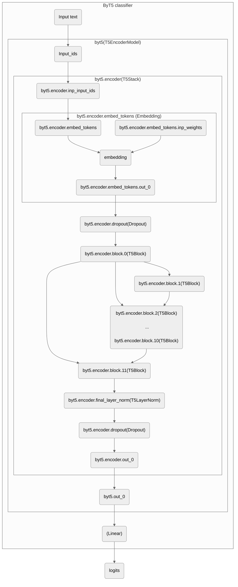

[](https://www.yachay.ai/) 

<p align="center">
<a href="https://twitter.com/YachayAi"></img></a>
<a href="https://www.reddit.com/user/yachay_ai"></img></a>
</p> 

<p align="center">
<a href="https://github.com/Yachay-AI/byt5-geotagging/stargazers"></img></a>
<a href="https://github.com/Yachay-AI/byt5-geotagging/forks"></img></a>
<a href="https://github.com/Yachay-AI/byt5-geotagging/contributors"></img></a>
<a href="https://github.com/Yachay-AI/byt5-geotagging/issues"></img></a>
<a href="https://github.com/Yachay-AI/byt5-geotagging/blob/master/LICENSE.md"></img></a>
</p> 

# Geotagging Model

This repository is designed to support developers in building and training their own geotagging models. The geotagging model architecture provided here allows for customization and training. Additionally, we suggest two curated datasets that are well-suited for training in different geolocation detection scenarios.

## Current Scores

The current models reach 30km Median Error on Haversine Distance for top 10% most relevant texts.

## Output Example

```json

{
   "text":"These kittens need homes and are located in the Omaha area! They have their shots and are spayed/neutered. They need to be gone by JAN 1st! Please Retweet to help spread the word!",
   "geotagging":{
      "lat":41.257160,
      "lon":-95.995102,
      "confidence":0.9950085878372192
   }
}
```

```geojson
{
  "type": "FeatureCollection",
  "features": [
    {
      "type": "Feature",
      "id": 1,
      "properties": {
        "ID": 0
      },
      "geometry": {
        "type": "Polygon",
        "coordinates": [
          [
            [-96.296363, 41.112793],
            [-96.296363, 41.345177],
            [-95.786877, 41.345177],
            [-95.786877, 41.112793],
            [-96.296363, 41.112793]
          ]
        ]
      }
    },
    {
      "type": "Feature",
      "id": 2,
      "properties": {
        "ID": 0
      },
      "geometry": {
        "type": "Point",
        "coordinates": [-95.995102, 41.257160]
      }
    }
  ]
}

```

## Datasets
Our team has curated two comprehensive datasets for two distinct training approaches. These datasets are intended for use in training and validating the models. [Share your training results in the repository issues](https://github.com/Yachay-AI/byt5-geotagging).

 **Regions dataset.** The goal of the Regions approach is to look into the dataset of top most populated regions around the world.

 The provided dataset is [**here**](https://drive.google.com/file/d/1thkE-hgT3sDtZqILZH17Hyayy0hkk_jh/view?usp=share_link), which:
- is an annotated corpus of 500k texts, as well as the respective geocoordinates
- covers 123 regions
- includes 5000 tweets per location

 **Seasons dataset.** The goal of the Seasons approach is to identify the correlation between the time/date of post, the content, and the location. Time zone differences, as well as seasonality of the events, should be analyzed and used to predict the location. For example: snow is more likely to appear in the Northern Hemisphere, especially if in December. Rock concerts are more likely to happen in the evening and in bigger cities, so the time of the post about a concert should be used to identify the time zone of the author and narrow down the list of potential locations. 

The provided dataset is **[here](https://drive.google.com/drive/folders/1P2QUGFBKaqdpZ4xAHmJMe2I57I94MJyO?usp=sharing)**, which:
- is a .json of >600.000 texts 
- collected over the span of 12 months
- covers 15 different time zones 
- focuses on 6 countries (Cuba, Iran, Russia, North Korea, Syria, Venezuela)

 **Your custom data.** The geotagging model supports training and testing on custom datasets. Prepare your data in CSV format with the following columns: `text`, `lat`, and `lon`. 

## Architecture 
<details>
<summary>Click to unfold geotagging model architecture diagram. </summary>


</details>

## Training
#### Dependencies
Ensure that the following dependencies are installed in your environment to build and train your geotagging model:

```
transformers==4.29.1
tqdm==4.63.2
pandas==1.4.4
pytorch==1.7.1
```

To train your geotagging model using the ByT5-encoder based approach, execute the following script:

```bash
python train_model.py --train_input_file <training_file> --test_input_file <test_file> --do_train true --do_test true --load_clustering .
```

Refer to the `train_model.py` file for a comprehensive list of available parameters.

## Confidence and Prediction 
The geotagging model incorporates confidence estimation to assess the reliability of predicted coordinates. The Relevance field in the output indicates prediction confidence, ranging from `0.0` to `1.0.` Higher values indicate increased confidence.
 For detailed information on confidence estimation and how to utilize the model for geotagging predictions, please refer to the `inference.py` file. This file provides an example script demonstrating the model architecture and integration of confidence estimation.

## Welcome!
### Forkers
[](https://github.com/Yachay-AI/byt5-geotagging/network/members)

Feel free to explore the code, adapt it to your specific requirements, and integrate it into your projects. If you have any questions or require assistance, please don't hesitate to reach out. We highly appreciate your feedback and are dedicated to continuously enhancing the geotagging models.
 
 <a href="https://discord.gg/msWFtcfmwe"></img></a>     <a href="https://twitter.com/YachayAi"></img></a>     <a href="https://www.reddit.com/user/yachay_ai"></img></a>
